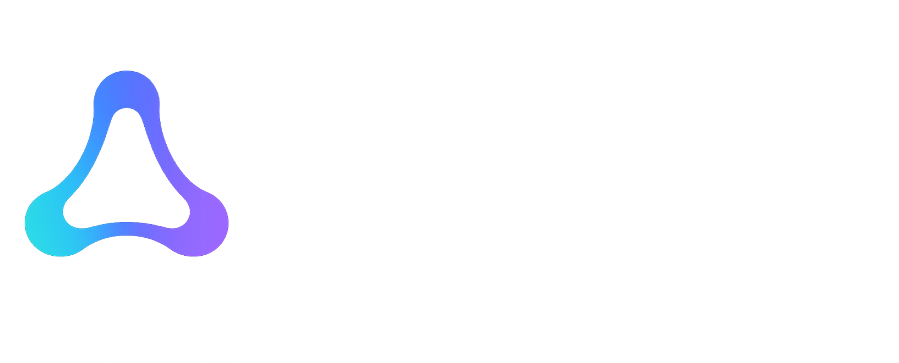

# 0xAgentio: Verifiable Coordination for Autonomous Agents

<p align="center">


</p>

## One-Liner

A framework for proof-carrying agent coordination - delegate bounded authority, coordinate peer-to-peer and verify actions at the edge, without forcing principals to expose private strategy, budgets or internal authorization.

## The Problem

AI agents are becoming economic actors. Trading, paying for compute or settling API calls. a16z calls this the "Know Your Agent" gap - agents need verifiable credentials before they can participate in any economy. Most approaches to KYA focus on identity: who is this agent, who is the principal behind it, are they compliant? That matters, but it's only half the problem.

The other half is delegation and coordination. There's no way for an agent to prove what it's authorized to do - or for other agents to verify that - without exposing everything about the principal behind it. And when agents need to coordinate with each other, they have no mechanism to establish trust without a central broker, reputation scores that take months to build or exposing private information.

Identity tells you who. 0xAgentio answers what, how much and with whom - the operational layer that agents actually need to act autonomously. ZK proofs make it possible to prove all of this without revealing any of it.

## The Solution

### The Framework: 0xAgentio

0xAgentio is a framework for verifiable agent coordination, built on two primitives:

**Primitive 1: Provable Delegation**

Agents carry ZK credentials - zero-knowledge proofs that attest to their delegated authority, operational bounds and policy constraints without revealing private inputs. The agent doesn't need to prove _who it is_ to every counterparty - it proves _what it's allowed to do_. A developer imports the SDK, defines a policy and their agent can generate and present proofs. The framework handles:

- **Delegation issuance**: A principal defines policy constraints -> signs delegation to agent -> agent holds private credential
- **Proof generation**: Efficient proofs attesting to delegated authority + budget bounds + policy constraints
- **Verification**: Off-chain (peer to peer) or on-chain (auto-generated Solidity verifier on any EVM chain)
- **Onchain registry**: Solidity contracts on 0G Chain for credential commitment, revocation and event logs
- **Persistent state**: 0G Storage for credential state, cumulative spend tracking and audit/interaction trails

What the credential proves (without revealing the private inputs):

- "I was delegated by a valid principal" (without revealing who)
- "This action is within my per-tx limit AND my cumulative spend is within total budget" (without revealing the exact numbers)
- "My actions match a signed policy hash" (auditable without being readable)

**Primitive 2: Verified P2P Coordination**

Delegation credentials are static on their own - they need a communication layer to become useful. The `axl` adapter turns AXL into a coordination network where agents discover, verify and collaborate with credentialed peers:

- **Credential-gated peer discovery**: An agent announces its capabilities and credential on the mesh. Other agents discover it, verify the credential and initiate collaboration. No marketplace or directory needed. The mesh itself _is_ the marketplace!
- **Trust-weighted signals**: Agents broadcast information (market signals, research findings, task results) with their credential attached. Receiving agents verify the sender's credential before trusting the signal and weight it by the sender's proven authorization level. An agent with a $50 budget carries more signal weight than one with $10 and you can't fake it.
- **Mutual verification handshakes**: Before two agents transact bilaterally, they exchange credentials over AXL. Both sides verify the other is authorized before proceeding. Neither side needs to know who the other's principal is - just that they're credentialed for the interaction.
- **Transport-layer filtering**: Unverified signals are dropped at the transport layer before reaching the application. The `axl` adapter is opinionated - if you can't prove your authority, your messages don't get through.
- **Instant authorization, no reputation needed**: Multi-agent systems need reputation scores that take time to build and are gameable. With 0xAgentio, authorization is instant: a brand-new agent with a valid credential can participate on its first interaction because the proof _is_ the authorization.

### Where 0xAgentio Applies

The framework is domain agnostic. The same delegation + coordination stack applies anywhere agents need to prove what they're authorized to do, discover verified peers and coordinate autonomously:

- **Data marketplace via mesh discovery**: A research agent announces on the AXL mesh: "I'm authorized by a biotech firm with a $10K data procurement budget, scoped to genomics datasets only." Data provider agents discover it, verify the credential and offer their datasets. No marketplace platform is needed: the mesh is the marketplace. The buyer proves budget and scope in ZK; the seller verifies before granting access.

- **Compute delegation**: A principal authorizes an agent to spend up to $X on GPU inference across decentralized compute providers. The agent discovers providers on the mesh, presents its budget credential and providers verify before accepting jobs. Multiple agents from the same principal can coordinate task splitting - each proving their individual budgets roll up to the same delegation.

- **Multi-agent task coordination**: A swarm of specialist agents (planner, researcher, executor, auditor) collaborate on a complex task. Each agent's credential proves its role and scope - the executor can commit up to $Y of resources, the auditor has read-only access to all execution logs. Agents verify each other's credentials over AXL before sharing work artifacts. The planner only accepts results from agents whose credentials prove the right scope.

- **API access gating**: An agent consumes third-party APIs on behalf of a principal. The credential proves the agent is rate-limited (max N calls/hour) and scoped to specific endpoints, without revealing private delegation details. API providers verify the credential instead of issuing long-lived API keys to anonymous bots.

The common pattern: a principal delegates bounded authority -> the agent proves its bounds in ZK -> the agent discovers and coordinates with verified peers over AXL -> counterparties verify the proof before interacting. 0xAgentio is the layer that makes all of this work without a central authority.

### Build on 0xAgentio

0xAgentio is infrastructure, not an application. Any agent application that needs provable delegation, bounded execution or verified coordination can be built on top of it:

```
 Trading app       Compute routing        Data marketplace       Your app
 (budget-bounded   (GPU jobs,             (scoped procurement,   ...
  DCA swaps)        inference spend)       genomics datasets)
        \                     |                       /                  /
         \                    |                      /                  /
          ┌─────────────────────────────────────────────────────────────┐
          │                    0xAgentio Framework                      │
          │       core · noir · axl · contracts · storage              │
          └─────────────────────────────────────────────────────────────┘
```

The framework is agnostic about _what_ the credential contains. For example, a trading application defines a circuit for "my budget is $5K, max $200 per trade." A compute marketplace defines a circuit for "I'm authorized to spend up to $X on GPU jobs." A data marketplace application defines a circuit for "I'm authorized to procure genomics data up to $10K." All three use the same SDK, the same AXL transport, the same onchain verifier, the same storage layer. Different credential types, same coordination infrastructure.

### The Demo App: 0xAgentio-Trade

The first application built on 0xAgentio. A multi-agent DCA trading system where agents autonomously trade on Uniswap within credential-enforced budget envelopes and share Sybil-resistant market signals over AXL. It demonstrates the framework in action - provable delegation, bounded execution and peer-to-peer coordination in a real trading scenario.
