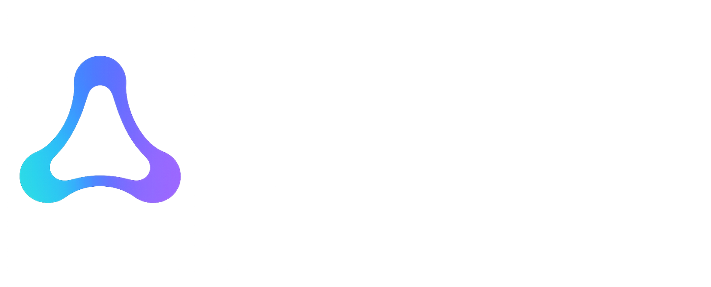

# 0xAgentio: Verifiable Coordination for Autonomous Agents

<p align="center">


</p>

## One-Liner

Agents should not be trusted because they say they are allowed to act. They should be trusted because they can prove it.

0xAgentio is a framework for proof-carrying agent coordination: delegate bounded authority, coordinate peer-to-peer and verify actions at the edge, without forcing principals to expose private strategy, budgets or internal authorization.

## The Problem

AI agents are moving from chat into action. They trade, call APIs, spend budgets, route compute, share research and coordinate with other agents. But most agent systems still ask counterparties to trust opaque runtime logs, API keys, reputation scores or the operator behind the agent.

That breaks down quickly. A receiving service needs to know whether an agent is allowed to perform a specific action, spend a specific amount, use a specific tool or access a specific dataset. Other agents need to verify claims before acting on them. Users need an audit trail that shows what happened after delegation, not just who the agent claimed to be.

Identity tells you who an agent is. 0xAgentio focuses on the next question: what is this agent allowed to do right now, under what bounds, and can another system verify that before doing work?

## The Solution

### The Framework: 0xAgentio

0xAgentio gives agents proof-carrying credentials and a verification flow for bounded execution. A principal defines a policy, delegates authority to an agent, and the agent can later present proof-backed requests that receivers verify before trusting, executing or replying.

The framework is built on two primitives:

**Primitive 1: Provable Delegation**

Agents carry credentials that attest to delegated authority, operational bounds and policy constraints. The agent does not need to reveal every private detail about its principal to every counterparty; it proves the action is inside the delegated envelope. A developer imports the SDK, defines a policy and their agent can generate and present proofs. The framework handles:

- **Delegation issuance**: A principal defines policy constraints -> signs delegation to agent -> agent holds private credential
- **Proof generation**: Proofs attesting to delegated authority, budget bounds and policy constraints
- **Verification**: Off-chain (peer to peer) or on-chain (auto-generated Solidity verifier on any EVM chain)
- **Onchain registry**: Solidity contracts for credential commitment, revocation and event logs
- **Persistent state**: Pluggable storage for credential state, cumulative spend tracking and audit trails

What the credential proves (without revealing the private inputs):

- "I was delegated by a valid principal" (without revealing who)
- "This action is within my per-tx limit AND my cumulative spend is within total budget" (without revealing the exact numbers)
- "My actions match a signed policy hash" (auditable without being readable)

**Primitive 2: Verified P2P Coordination**

Delegation credentials are static on their own - they need a communication layer to become useful. The `axl` adapter turns AXL into a coordination network where agents discover, verify and collaborate with credentialed peers:

- **Credential-gated peer discovery**: An agent announces its capabilities and credential on the mesh. Other agents discover it, verify the credential and initiate collaboration. No marketplace or directory needed. The mesh itself _is_ the marketplace!
- **Trust-weighted signals**: Agents broadcast information (market signals, research findings, task results) with their credential attached. Receiving agents verify the sender's credential before trusting the signal and weight it by the sender's proven authorization level. An agent with a $50 budget carries more signal weight than one with $10 and you can't fake it.
- **Mutual verification handshakes**: Before two agents transact bilaterally, they exchange credentials over AXL. Both sides verify the other is authorized before proceeding. Neither side needs to know who the other's principal is - just that they're credentialed for the interaction.
- **Transport-layer filtering**: Unverified signals are dropped at the transport layer before reaching the application. The `axl` adapter is opinionated - if you can't prove your authority, your messages don't get through.
- **Instant authorization, no reputation needed**: Multi-agent systems need reputation scores that take time to build and are gameable. With 0xAgentio, authorization is instant: a brand-new agent with a valid credential can participate on its first interaction because the proof _is_ the authorization.

### Where 0xAgentio Applies

The framework is domain agnostic. The same delegation + coordination stack applies anywhere agents need to prove what they're authorized to do, discover verified peers and coordinate autonomously:

- **Data marketplace via mesh discovery**: A research agent announces on the AXL mesh: "I'm authorized by a biotech firm with a $10K data procurement budget, scoped to genomics datasets only." Data provider agents discover it, verify the credential and offer their datasets. No marketplace platform is needed: the mesh is the marketplace. The buyer proves budget and scope in ZK; the seller verifies before granting access.

- **Compute delegation**: A principal authorizes an agent to spend up to $X on GPU inference across decentralized compute providers. The agent discovers providers on the mesh, presents its budget credential and providers verify before accepting jobs. Multiple agents from the same principal can coordinate task splitting - each proving their individual budgets roll up to the same delegation.

- **Multi-agent task coordination**: A swarm of specialist agents (planner, researcher, executor, auditor) collaborate on a complex task. Each agent's credential proves its role and scope - the executor can commit up to $Y of resources, the auditor has read-only access to all execution logs. Agents verify each other's credentials over AXL before sharing work artifacts. The planner only accepts results from agents whose credentials prove the right scope.

- **API access gating**: An agent consumes third-party APIs on behalf of a principal. The credential proves the agent is rate-limited (max N calls/hour) and scoped to specific endpoints, without revealing private delegation details. API providers verify the credential instead of issuing long-lived API keys to anonymous bots.

The common pattern: a principal delegates bounded authority -> the agent proves its bounds -> the agent discovers and coordinates with verified peers -> counterparties verify before interacting. 0xAgentio is the layer that makes this work without a central broker.

### Build on 0xAgentio

0xAgentio is infrastructure, not an application. Any agent application that needs provable delegation, bounded execution or verified coordination can be built on top of it:

```
 Trading app       Compute routing        Data marketplace       Your app
 (budget-bounded   (GPU jobs,             (scoped procurement,   ...
  DCA swaps)        inference spend)       genomics datasets)
        \                     |                       /                  /
         \                    |                      /                  /
          ┌─────────────────────────────────────────────────────────────┐
          │                    0xAgentio Framework                      │
          │       core · noir · transport · contracts · storage        │
          └─────────────────────────────────────────────────────────────┘
```

The framework is agnostic about _what_ the credential contains. For example, a trading application defines a circuit for "my budget is $5K, max $200 per trade." A compute marketplace defines a circuit for "I'm authorized to spend up to $X on GPU jobs." A data marketplace application defines a circuit for "I'm authorized to procure genomics data up to $10K." All three use the same SDK shape, proof model, verifier boundary and storage pattern. Different credential types, same coordination infrastructure.

### Current Local SDK vs. Final Adapters

The current implementation starts with local adapters so the framework can be developed and tested before external systems are connected. The public API is intentionally shaped so these local pieces can be swapped for real infrastructure later.

| Current local adapter    | Final adapter                                     | Role in the framework                                              |
| ------------------------ | ------------------------------------------------- | ------------------------------------------------------------------ |
| `localPolicyProofs()`    | `noirProofs()`                                    | Proves an action satisfies the delegated policy.                   |
| `localMemoryStorage()`   | durable storage adapter                           | Stores agent state, credential state and audit receipts.           |
| `localTransport()`       | `axlTransport()`                                  | Carries proof-backed peer messages between agents.                 |
| `localExecution()`       | custom execution adapters                         | Executes authorized actions after validation and proof generation. |
| `issueLocalCredential()` | signed credential issuance                        | Binds an agent to a delegated policy.                              |

This lets the SDK flow stay stable while the internals become progressively more real:

```ts
const agent = createTrustedAgent({
  identity,
  credential,
  policy,
  reasoning,
  proof: noirProofs(),
  storage: ogStorage(),
  transport: axlTransport(),
  execution: appExecutionAdapter(),
});
```

For now, the local adapters are not pretending to be secure production implementations. They are scaffolding for the final architecture: prove with Noir, coordinate over a transport, persist audit state and execute through domain-specific adapters.

### Quick Start

Run the canonical local walkthrough:

```sh
npm install
npm run build
npm run example:getting-started
```

The example shows the core value prop without external credentials: Alice carries
a delegated policy, sends Bob a proof-backed quote request, Bob verifies before
replying, Alice reasons over the reply, and Alice's runtime validates, proves,
stores and executes the final action through a verifying adapter.

### AgentProof Demo

`AgentProof` is a demo layer on top of 0xAgentio. It turns one verified agent action into a shareable verification passport: task, agent id, verdict, proof hash, trace hash, output hash, storage root and receipt metadata.

Run it locally:

```sh
npm run example:agentproof
```

Then open `landing/agentproof-passport.html`. The demo is deterministic by default, so it works without credentials. If you provide live storage and chain environment variables, the same flow can replace the local preview receipt with live decentralized evidence and anchoring.

For the full live stack with real Noir, live 0G KV and real local Gensyn AXL
nodes, use:

```sh
npm run example:live-stack
```


### Submission-Ready Demo: AgentProof

The main demo is now AgentProof: one verified agent action, one evidence bundle, one verification passport. It keeps the product generic and shows the framework as reusable infrastructure rather than a finance-specific app.

Run it with:

```sh
npm run example:agentproof
```

Then open `landing/agentproof-passport.html`.
